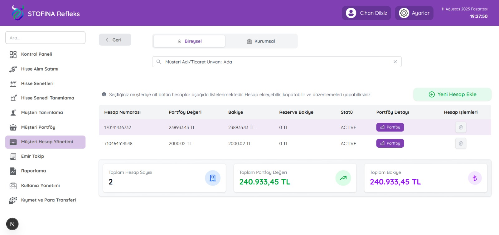
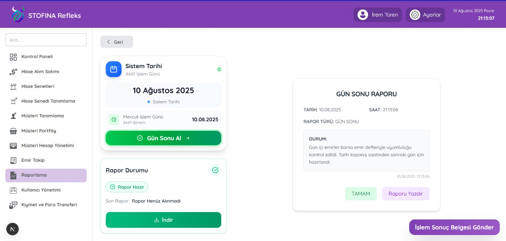

# STOFINA Refleks - Hisse Alım Satım Platformu

**Stofina Refleks**, aracı kurumların **hisse alım-satım, emir takibi ve portföy yönetimi** işlemlerini güvenli, hızlı ve kullanıcı dostu bir şekilde gerçekleştirmesini sağlayan modern bir **fintech platformudur.**  
Proje, mikroservis mimarisi, yüksek güvenlik standartları ve sade kullanıcı arayüzü ile finansal kurumların dijital dönüşümüne katkı sağlamayı amaçlamaktadır.

---

## Genel Bakış

Bu proje kapsamında:
- **Spring Boot (Java 17)** kullanılarak mikroservis tabanlı bir backend mimarisi geliştirildi.  
- **Next.js (TypeScript)** ile kullanıcı dostu, modern ve responsive bir frontend oluşturuldu.  
- **JWT tabanlı kimlik doğrulama**, güvenli giriş ve erişim kontrolünü sağladı.  
- Gerçek zamanlı veri akışı için **Kafka**, önbellekleme için **Redis** kullanıldı.  
- Uygulama, **Docker** ile containerize edilerek taşınabilir hale getirildi.  

---

## Mimarinin Genel Yapısı

| Katman | Teknolojiler |
|--------|---------------|
| **Backend** | Java 17, Spring Boot 3.3.1, Spring Security, JPA |
| **Frontend** | Next.js, TypeScript, Redux Thunk, Tailwind CSS |
| **Database** | MSSQL (Prod), Azure SQL Edge (Dev) |
| **Cache / Queue** | Redis, Kafka, Zookeeper |
| **Containerization** | Docker, Docker Compose |
| **Monitoring** | Grafana, Prometheus, Loki, Tempo, Alloy |
| **Storage** | MinIO (dosya depolama) |

---

## Örnek Ekranlar

###  Müşteri Hesap Yönetimi
Kullanıcıların sahip olduğu tüm yatırım hesaplarını görüntüleme, yeni hesap ekleme, portföy detaylarını inceleme ve bakiye kontrolü işlemleri yapılabilir.  
Ayrıca bireysel ve kurumsal müşteri tipleri arasında geçiş yapılabilir.

---

### Raporlama Ekranı
Sistem tarihi, işlem günü, gün sonu raporu ve borsa uyum kontrolü bu ekran üzerinden yönetilir.  
Kullanıcı, raporu görüntüleyebilir, yazdırabilir veya dışa aktarabilir.

---

## Geliştirme Süreci

| Aşama | Açıklama |
|--------|-----------|
| **1. Ürün Tanımı ve Marka Kimliği** | Finansal platformun marka kimliği oluşturuldu. |
| **2. Gereksinim Analizi** | Aracı kurumların ihtiyaçları detaylı analiz edildi. |
| **3. Figma Tasarımı** | Tüm modüller için ekran prototipleri tasarlandı. |
| **4. Backend & Frontend Geliştirme** | Mikroservis mimarisi ve arayüz entegrasyonu tamamlandı. |
| **5. Test & Dokümantasyon** | API testleri, kullanıcı kılavuzu ve raporlamalar hazırlandı. |
| **6. Yayınlama** | Docker Compose üzerinden containerize edilerek yayınlandı. |

---

